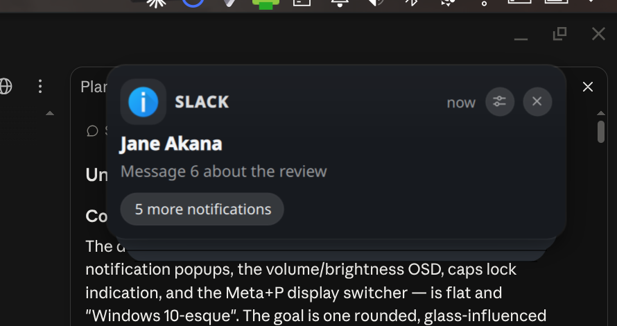
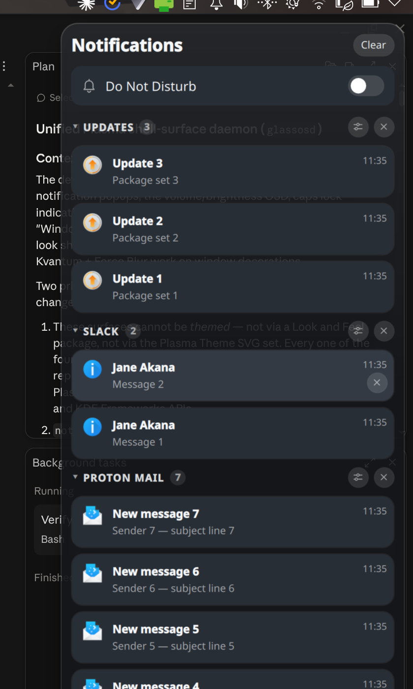
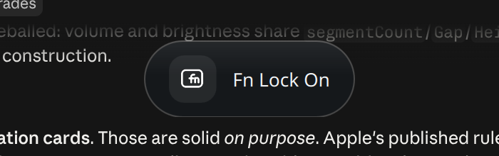
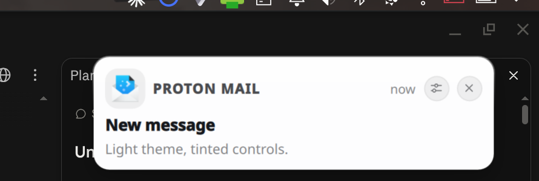

# glassosd

A notification daemon, on-screen display and notification centre for Wayland,
drawn as one piece of glass.

Most desktops split these across three programs that look nothing like each
other: a notification daemon, whatever the compositor uses for its volume
popup, and a separate control centre. glassosd draws all of them with the same
rounded, blurred, translucent surface, and behaves the way a notification
daemon should when the desktop gets busy.

---

## What it does

**Notifications** — full [freedesktop Desktop Notifications][spec]
implementation, plus the KDE extensions: inline reply, action icons, raw image
hints, and `NotificationReplied`. Nothing about the layout is hardcoded to
particular apps; buttons, reply fields and progress bars appear because the
sending application published them.

**Behaviour that matters at volume:**

| | |
|---|---|
| Rate limiting | at most *N* on screen; the rest queue behind a "+N more" indicator |
| Burst coalescing | 30 mails arriving at once become one card that says 30 |
| Replace by tag | `x-kde-display-appname` / stack tags update in place |
| Idle threshold | popups that appeared while you were away wait for you |
| Persistent history | survives a restart, grouped by app, collapsible |
| Do Not Disturb | persists across login |
| Per-app rules | match on app, summary, body, category, urgency |

**OSD** — volume, microphone, brightness, keyboard backlight, caps/num/Fn
lock, touchpad, wifi, bluetooth, power profile.

**Notification centre** — history grouped by app, a DND toggle, and an MPRIS
media player widget.

## Screenshots

| | |
|---|---|
|  |  |
| Grouped notification stack | Notification centre |
|  |  |
| Volume OSD | Light theme |

---

## Compositor support

glassosd needs `wlr-layer-shell-unstable-v1`. That covers KDE Plasma,
Hyprland, sway, river, Wayfire, labwc and anything else wlroots-based. It does
**not** work on GNOME, which does not implement layer-shell.

Plasma-specific integration is detected at runtime, never required at build
time. Where a feature has no portable equivalent, there is a D-Bus/CLI way in:

| Feature | Plasma | Elsewhere |
|---|---|---|
| Notifications | ✅ | ✅ |
| Notification centre, history, DND, rules | ✅ | ✅ |
| Background blur | ✅ automatic (KWin) | compositor config, see below |
| Volume/brightness OSD | ✅ automatic | route your media keys through `glassosdctl osd` |
| Global shortcuts | ✅ registered for you | bind `glassosdctl` in your compositor config |
| Caps/Num Lock OSD | ✅ | ✗ — needs `org_kde_kwin_keystate`, which is KWin-only |
| Tray icon | ✅ | ✅ with any StatusNotifierItem host (waybar, etc.) |

### Hyprland

Blur is applied by the compositor, matched on the layer namespace. glassosd
uses three: `glassosd-osd`, `glassosd-notifications`, `glassosd-history`.

```
layerrule = blur on, ignore_alpha 0.2, match:namespace glassosd-osd
layerrule = blur on, ignore_alpha 0.2, match:namespace glassosd-notifications
layerrule = blur on, ignore_alpha 0.2, match:namespace glassosd-history

exec-once = glassosd

bind = SUPER, N, exec, glassosdctl history
bind = SUPER SHIFT, N, exec, glassosdctl dnd toggle

bindl = , XF86AudioRaiseVolume, exec, glassosdctl osd volume raise
bindl = , XF86AudioLowerVolume, exec, glassosdctl osd volume lower
bindl = , XF86AudioMute,        exec, glassosdctl osd volume mute
bindl = , XF86AudioMicMute,     exec, glassosdctl osd mic mute
bindl = , XF86MonBrightnessUp,   exec, glassosdctl osd brightness raise
bindl = , XF86MonBrightnessDown, exec, glassosdctl osd brightness lower
```

### sway

```
exec glassosd

bindsym $mod+n exec glassosdctl history
bindsym $mod+Shift+n exec glassosdctl dnd toggle

bindsym --locked XF86AudioRaiseVolume exec glassosdctl osd volume raise
bindsym --locked XF86AudioLowerVolume exec glassosdctl osd volume lower
bindsym --locked XF86AudioMute        exec glassosdctl osd volume mute
bindsym --locked XF86MonBrightnessUp   exec glassosdctl osd brightness raise
bindsym --locked XF86MonBrightnessDown exec glassosdctl osd brightness lower
```

sway has no compositor-side blur, and unblurred translucency over a photo
wallpaper is genuinely hard to read. Push the glass toward opaque:

```bash
glassosdctl solidity 0.6   # 0 keeps the tuned glass, 1 is fully solid
```

### Plasma

Everything is automatic. Turn off Plasma's own popups so they do not double up:

```bash
kwriteconfig6 --file plasmarc --group OSD --key Enabled false
```

---

## Install

### Fedora (COPR)

```bash
sudo dnf copr enable SmallTardigrade/glassosd
sudo dnf install glassosd
```

### From source

```bash
sudo dnf install cmake gcc-c++ ninja-build extra-cmake-modules dbus-devel \
  qt6-qtbase-devel qt6-qtdeclarative-devel layer-shell-qt-devel \
  kf6-kwindowsystem-devel kf6-kguiaddons-devel kf6-kconfig-devel \
  kf6-ki18n-devel kf6-kglobalaccel-devel kf6-kstatusnotifieritem-devel \
  kf6-kidletime-devel systemd-rpm-macros

cmake -B build -DCMAKE_BUILD_TYPE=Release
cmake --build build -j$(nproc)
sudo cmake --install build
```

Arch, Debian and openSUSE package names are listed in
[packaging/DEPENDENCIES.md](packaging/DEPENDENCIES.md).

### Then

```bash
systemctl --user enable --now glassosd.service
```

glassosd is also D-Bus activated, so the next application to post a
notification would start it anyway — but the OSD and the notification centre
need it running for the whole session.

To keep the notification daemon you already have and use glassosd only for the
OSD:

```bash
glassosdctl set Enabled false
```

---

## Configuration

Everything is `~/.config/glassosdrc`, and every key has a CLI equivalent that
applies live — no restart:

```bash
glassosdctl status              # what is running, and every current setting
glassosdctl set Limit 5         # popups on screen at once
glassosdctl theme light
glassosdctl accent '#d95f02'    # auto-darkened if it would fail contrast
glassosdctl scale 1.2           # everything, proportionally
glassosdctl width 420
glassosdctl widgets media,dnd
glassosdctl level bar           # or segmented
glassosdctl test                # fire the demo sequence
```

Per-app rules:

```bash
glassosdctl rule-set signal appname=Signal set_stack_tag=chat timeout=8000
glassosdctl rule-set noisy   appname=Steam skip_display=true
glassosdctl rules
```

Full key list: `glassosdctl --help`.

---

## Licence

GPL-2.0-or-later.

This is not a free choice. `src/osdmodel.cpp` is a port of
`shell/osd.cpp` from [plasma-workspace][pw], which is GPL-2.0-or-later; the
original authors' copyright is carried in that file's header. Everything
derived from it inherits those terms.

The icon set in `qml/icons/` is CC0-1.0, so it can be lifted into a bar, a
theme or another shell without inheriting the GPL.

The project is [REUSE][reuse]-compliant: every file carries an SPDX header or
is covered by `REUSE.toml`.

[spec]: https://specifications.freedesktop.org/notification-spec/latest/
[pw]: https://invent.kde.org/plasma/plasma-workspace
[reuse]: https://reuse.software/
